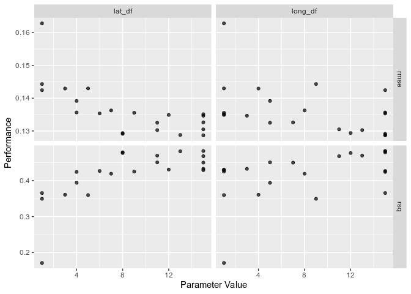
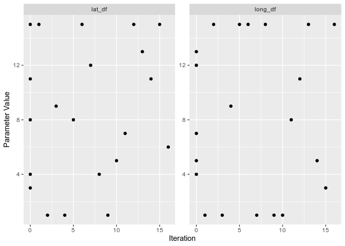
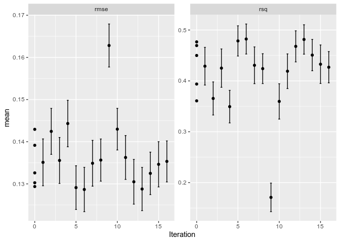
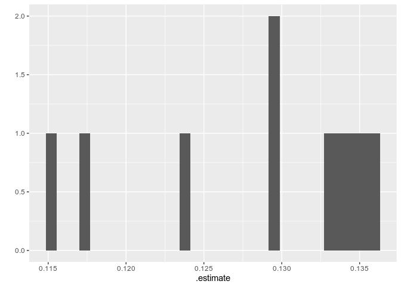

<!-- README.md is generated from README.Rmd. Please edit that file -->

# shinytune

<!-- badges: start -->

<!-- badges: end -->

The goal of shinytune is to make it easy to explore `tune` objects,
similar to `shinystan`.

To do this I need to:

  - ~~Figure out exactly what `tune` is producing~~
  - Figure out how to deal with `tune_` outputs which contain the
    (optional) `.predictions` and/or `.extracts` information
  - Think about some sensible summaries/visualisations/explorations that
    could be applied to that
  - Compare to `shinystan` for reference (I don’t want to anchor too
    strongly to it, though)

## Exploring `tune`

Firstly, I need to figure out what `tune` object actually contains.

Let’s create one following the Getting Started guide on the [tune
website](https://tidymodels.github.io/tune/articles/getting_started.html).

``` r
library(tidymodels)
#> ── Attaching packages ──────────────────────────────────────────────────────────────────────────────────────────────────────────────────────────────────── tidymodels 0.0.3 ──
#> ✓ broom     0.5.2     ✓ purrr     0.3.3
#> ✓ dials     0.0.4     ✓ recipes   0.1.9
#> ✓ dplyr     0.8.4     ✓ rsample   0.0.5
#> ✓ ggplot2   3.2.1     ✓ tibble    2.1.3
#> ✓ infer     0.5.1     ✓ yardstick 0.0.5
#> ✓ parsnip   0.0.5
#> ── Conflicts ─────────────────────────────────────────────────────────────────────────────────────────────────────────────────────────────────────── tidymodels_conflicts() ──
#> x purrr::discard()    masks scales::discard()
#> x dplyr::filter()     masks stats::filter()
#> x dplyr::lag()        masks stats::lag()
#> x ggplot2::margin()   masks dials::margin()
#> x recipes::step()     masks stats::step()
#> x recipes::yj_trans() masks scales::yj_trans()
library(tune)
```

### Create the tune objects

Let’s just create the whole set of outputs for the Getting Started
vignette.

Firstly we’ll set up the data:

``` r
library(AmesHousing)

ames <- make_ames()

set.seed(4595)
data_split <- initial_split(ames, strata = "Sale_Price")
ames_train <- training(data_split)
ames_test  <- testing(data_split)
```

Then the baseline
recipe

``` r
ames_rec <- recipe(Sale_Price ~ Longitude + Latitude, data = ames_train) %>% 
  step_log(Sale_Price, base = 10) %>% 
  step_ns(Longitude, deg_free = tune("long_df")) %>% 
  step_ns(Latitude,  deg_free = tune("lat_df"))

ames_rec
#> Data Recipe
#> 
#> Inputs:
#> 
#>       role #variables
#>    outcome          1
#>  predictor          2
#> 
#> Operations:
#> 
#> Log transformation on Sale_Price
#> Natural Splines on Longitude
#> Natural Splines on Latitude
```

Then update the parameters to use a better function with a wider range:

``` r
ames_param <- ames_rec %>% 
  parameters() %>% 
  update(
    long_df = spline_degree(), 
    lat_df = spline_degree()
  )

ames_param
#> Collection of 2 parameters for tuning
#> 
#>       id parameter type object class
#>  long_df       deg_free    nparam[+]
#>   lat_df       deg_free    nparam[+]
```

Then we’ll set up the (grid) search space of values for these
parameters:

``` r
spline_grid <- grid_max_entropy(ames_param, size = 10)
spline_grid
#> # A tibble: 10 x 2
#>    long_df lat_df
#>      <int>  <int>
#>  1       3      6
#>  2      10     10
#>  3       8      7
#>  4       3     10
#>  5       7     10
#>  6       4      3
#>  7       4      8
#>  8       7      4
#>  9       5      6
#> 10      10      5
```

Then our (linear) model:

``` r
lm_mod <- linear_reg() %>% 
    set_engine("lm")

lm_mod
#> Linear Regression Model Specification (regression)
#> 
#> Computational engine: lm
```

Then we’ll set up the cross validation scheme to search over:

``` r
set.seed(2453)
cv_splits <- vfold_cv(ames_train, v = 10, strata = "Sale_Price")
```

### `tune_grid()`

Then finally we’ll do the tuning using `tune_grid()`:

``` r
ames_res <- tune_grid(
    ames_rec,
    model = lm_mod,
    resamples = cv_splits,
    grid = spline_grid
)
ames_res
#> #  10-fold cross-validation using stratification 
#> # A tibble: 10 x 4
#>    splits           id     .metrics          .notes          
#>  * <list>           <chr>  <list>            <list>          
#>  1 <split [2K/221]> Fold01 <tibble [20 × 5]> <tibble [0 × 1]>
#>  2 <split [2K/220]> Fold02 <tibble [20 × 5]> <tibble [0 × 1]>
#>  3 <split [2K/220]> Fold03 <tibble [20 × 5]> <tibble [0 × 1]>
#>  4 <split [2K/220]> Fold04 <tibble [20 × 5]> <tibble [0 × 1]>
#>  5 <split [2K/220]> Fold05 <tibble [20 × 5]> <tibble [0 × 1]>
#>  6 <split [2K/220]> Fold06 <tibble [20 × 5]> <tibble [0 × 1]>
#>  7 <split [2K/220]> Fold07 <tibble [20 × 5]> <tibble [0 × 1]>
#>  8 <split [2K/220]> Fold08 <tibble [20 × 5]> <tibble [0 × 1]>
#>  9 <split [2K/220]> Fold09 <tibble [20 × 5]> <tibble [0 × 1]>
#> 10 <split [2K/218]> Fold10 <tibble [20 × 5]> <tibble [0 × 1]>
```

Let’s start out by looking at the class of those results:

``` r
class(ames_res)
#> [1] "tune_results" "vfold_cv"     "rset"         "tbl_df"      
#> [5] "tbl"          "data.frame"
```

As detailed in the `?tune_grid` documentation, we have an updated
resamples result, but with some new info an an extra class. But
ultimately it’s still a rectangle. Let’s check the methods for the new
class (the first one) to see what might be available “for free”.

``` r
methods(class = class(ames_res)[[1]])
#> [1] autoplot
#> see '?methods' for accessing help and source code
```

So the only built-in method for the `_results` is `autoplot()`. So
there’s not a huge amount we get out using S3.

What does the `autoplot()` look like?

``` r
autoplot(ames_res)
```

<!-- -->

We’ve got the performance metrics over our parameter value(s).

Let’s look at the extra columns in a bit more detail:

``` r
ames_res$.metrics[[1]]
#> # A tibble: 20 x 5
#>    long_df lat_df .metric .estimator .estimate
#>      <int>  <int> <chr>   <chr>          <dbl>
#>  1       3      6 rmse    standard       0.146
#>  2       3      6 rsq     standard       0.393
#>  3      10     10 rmse    standard       0.136
#>  4      10     10 rsq     standard       0.473
#>  5       8      7 rmse    standard       0.142
#>  6       8      7 rsq     standard       0.428
#>  7       3     10 rmse    standard       0.137
#>  8       3     10 rsq     standard       0.468
#>  9       7     10 rmse    standard       0.136
#> 10       7     10 rsq     standard       0.474
#> 11       4      3 rmse    standard       0.150
#> 12       4      3 rsq     standard       0.361
#> 13       4      8 rmse    standard       0.138
#> 14       4      8 rsq     standard       0.455
#> 15       7      4 rmse    standard       0.145
#> 16       7      4 rsq     standard       0.403
#> 17       5      6 rmse    standard       0.144
#> 18       5      6 rsq     standard       0.415
#> 19      10      5 rmse    standard       0.143
#> 20      10      5 rsq     standard       0.416
```

`.metrics`, contrains the error/summary metrics for each combination of
the parameters in our grid. Per the docs, the model type informs the
default choice of metric, but we can also specify what we’re after with
the `metrics` parameter in `tune_grid()`.

The `.notes` column should contain extra warnings/errors that occurred
during execution.

``` r
map_dfr(ames_res$.notes, I)
#> # A tibble: 0 x 1
#> # … with 1 variable: .notes <chr>
```

We didn’t have any here.

The docs also show the `collect_metrics()` function for aggregating the
error metrics over the resamples. We can get summary (mean) values per
grid combination (the default):

``` r
collect_metrics(ames_res)
#> # A tibble: 20 x 7
#>    long_df lat_df .metric .estimator  mean     n std_err
#>      <int>  <int> <chr>   <chr>      <dbl> <int>   <dbl>
#>  1       3      6 rmse    standard   0.142    10 0.00216
#>  2       3      6 rsq     standard   0.365    10 0.0169 
#>  3       3     10 rmse    standard   0.136    10 0.00234
#>  4       3     10 rsq     standard   0.423    10 0.0164 
#>  5       4      3 rmse    standard   0.143    10 0.00231
#>  6       4      3 rsq     standard   0.361    10 0.0160 
#>  7       4      8 rmse    standard   0.135    10 0.00227
#>  8       4      8 rsq     standard   0.429    10 0.0151 
#>  9       5      6 rmse    standard   0.139    10 0.00216
#> 10       5      6 rsq     standard   0.397    10 0.0142 
#> 11       7      4 rmse    standard   0.140    10 0.00221
#> 12       7      4 rsq     standard   0.387    10 0.0140 
#> 13       7     10 rmse    standard   0.133    10 0.00236
#> 14       7     10 rsq     standard   0.443    10 0.0146 
#> 15       8      7 rmse    standard   0.136    10 0.00233
#> 16       8      7 rsq     standard   0.419    10 0.0153 
#> 17      10      5 rmse    standard   0.137    10 0.00228
#> 18      10      5 rsq     standard   0.414    10 0.0140 
#> 19      10     10 rmse    standard   0.131    10 0.00243
#> 20      10     10 rsq     standard   0.461    10 0.0146
```

Or not, in which case we get the exact metrics from each fold (maybe
useful if we want to compute our own summaries).

``` r
collect_metrics(ames_res, FALSE)
#> # A tibble: 200 x 6
#>    id     long_df lat_df .metric .estimator .estimate
#>    <chr>    <int>  <int> <chr>   <chr>          <dbl>
#>  1 Fold01       3      6 rmse    standard       0.146
#>  2 Fold01       3      6 rsq     standard       0.393
#>  3 Fold01      10     10 rmse    standard       0.136
#>  4 Fold01      10     10 rsq     standard       0.473
#>  5 Fold01       8      7 rmse    standard       0.142
#>  6 Fold01       8      7 rsq     standard       0.428
#>  7 Fold01       3     10 rmse    standard       0.137
#>  8 Fold01       3     10 rsq     standard       0.468
#>  9 Fold01       7     10 rmse    standard       0.136
#> 10 Fold01       7     10 rsq     standard       0.474
#> # … with 190 more rows
```

The documentation then uses these result to plot/calcualte bespoke
summaries to inform modelling decisions, and the use of `tune` or other
`tidymodels` functions/packages seems to end.

In any case, the output seems reasonably simple: `tune_grid()` will
return a set of metrics (that may be customised via the `metrics`)
argument for each combination in the grid.

#### Adding predictions

Let’s also consider using `control_grid()` to add the `.predictions`
data to the results of our tuning:

``` r
ames_res_with_pred <- tune_grid(
    ames_rec,
    model = lm_mod,
    resamples = cv_splits,
    grid = spline_grid,
    control = control_grid(save_pred = TRUE)
)
ames_res_with_pred
#> #  10-fold cross-validation using stratification 
#> # A tibble: 10 x 5
#>    splits          id     .metrics        .notes         .predictions      
#>  * <list>          <chr>  <list>          <list>         <list>            
#>  1 <split [2K/221… Fold01 <tibble [20 × … <tibble [0 × … <tibble [2,210 × …
#>  2 <split [2K/220… Fold02 <tibble [20 × … <tibble [0 × … <tibble [2,200 × …
#>  3 <split [2K/220… Fold03 <tibble [20 × … <tibble [0 × … <tibble [2,200 × …
#>  4 <split [2K/220… Fold04 <tibble [20 × … <tibble [0 × … <tibble [2,200 × …
#>  5 <split [2K/220… Fold05 <tibble [20 × … <tibble [0 × … <tibble [2,200 × …
#>  6 <split [2K/220… Fold06 <tibble [20 × … <tibble [0 × … <tibble [2,200 × …
#>  7 <split [2K/220… Fold07 <tibble [20 × … <tibble [0 × … <tibble [2,200 × …
#>  8 <split [2K/220… Fold08 <tibble [20 × … <tibble [0 × … <tibble [2,200 × …
#>  9 <split [2K/220… Fold09 <tibble [20 × … <tibble [0 × … <tibble [2,200 × …
#> 10 <split [2K/218… Fold10 <tibble [20 × … <tibble [0 × … <tibble [2,180 × …
```

Let’s look at one value of predictions:

``` r
ames_res_with_pred$.predictions[[1]]
#> # A tibble: 2,210 x 5
#>    .pred  .row long_df lat_df Sale_Price
#>    <dbl> <int>   <int>  <int>      <dbl>
#>  1  5.34     9       3      6       5.25
#>  2  5.43    32       3      6       5.60
#>  3  5.42    33       3      6       5.34
#>  4  5.42    35       3      6       5.79
#>  5  5.31    71       3      6       5.41
#>  6  5.30    75       3      6       5.17
#>  7  5.14    96       3      6       5.30
#>  8  5.14   121       3      6       5.38
#>  9  5.06   124       3      6       5.22
#> 10  5.06   125       3      6       5.13
#> # … with 2,200 more rows
```

So we have the prediction across many rows of the data, based on our
resamples?

``` r
count(ames_res_with_pred$.predictions[[1]], long_df, lat_df)
#> # A tibble: 10 x 3
#>    long_df lat_df     n
#>      <int>  <int> <int>
#>  1       3      6   221
#>  2       3     10   221
#>  3       4      3   221
#>  4       4      8   221
#>  5       5      6   221
#>  6       7      4   221
#>  7       7     10   221
#>  8       8      7   221
#>  9      10      5   221
#> 10      10     10   221
```

Yes, for each evaluation/parameter set, we’ve got the out-of-sample
predictions (like the docs say, but it’s nice to verify).

Let’s use the built in helper to get them, too:

``` r
collect_predictions(ames_res_with_pred)
#> # A tibble: 21,990 x 6
#>    id     .pred  .row long_df lat_df Sale_Price
#>    <chr>  <dbl> <int>   <int>  <int>      <dbl>
#>  1 Fold01  5.34     9       3      6       5.25
#>  2 Fold01  5.43    32       3      6       5.60
#>  3 Fold01  5.42    33       3      6       5.34
#>  4 Fold01  5.42    35       3      6       5.79
#>  5 Fold01  5.31    71       3      6       5.41
#>  6 Fold01  5.30    75       3      6       5.17
#>  7 Fold01  5.14    96       3      6       5.30
#>  8 Fold01  5.14   121       3      6       5.38
#>  9 Fold01  5.06   124       3      6       5.22
#> 10 Fold01  5.06   125       3      6       5.13
#> # … with 21,980 more rows
```

As expected, over our grid of 10 lat/long DF combinations, we get, for
each resample, the out-of-sample predictions (so 10 values per
observation in the validation set across each resample fold).

Per the documentation, the column names may differ if we have a
classification model (e.g. `.pred_class`), so we’ll need to be careful
there if we’re thinking about a general framework.

#### Adding extractions

Let’s instead use `control_grid()`’s `extract` argument. This is an
“optional function with at least one argument that can be used to
retain arbitrary objects from the model fit object, receipe, or other
elements of the workflow”.

Continuing, the help file for `tune_bayesian()` notes that:

> The control function contains an option (extract) that can be used to
> retain any model or recipe that was created within the resamples. This
> argument should be a function with a single argument. The value of the
> argument that is given to the function in each resample is a workflow
> object (see `workflows::workflow()` for more information). There are
> two helper functions that can be used to easily pull out the recipe
> (if any) and/or the model: `extract_recipe()` and `extract_model()`.

The fact that this can be arbitrary may mean this is hard to include in
anything like `shinytune` which should be *general* and not too
arbitrary, but let’s explore nonetheless. First off we’ll extract the
model:

``` r
ames_res_mod <- tune_grid(
    ames_rec,
    model = lm_mod,
    resamples = cv_splits,
    grid = spline_grid,
    control = control_grid(extract = extract_model)
)
ames_res_mod
#> #  10-fold cross-validation using stratification 
#> # A tibble: 10 x 5
#>    splits          id     .metrics          .notes         .extracts       
#>  * <list>          <chr>  <list>            <list>         <list>          
#>  1 <split [2K/221… Fold01 <tibble [20 × 5]> <tibble [0 × … <tibble [10 × 3…
#>  2 <split [2K/220… Fold02 <tibble [20 × 5]> <tibble [0 × … <tibble [10 × 3…
#>  3 <split [2K/220… Fold03 <tibble [20 × 5]> <tibble [0 × … <tibble [10 × 3…
#>  4 <split [2K/220… Fold04 <tibble [20 × 5]> <tibble [0 × … <tibble [10 × 3…
#>  5 <split [2K/220… Fold05 <tibble [20 × 5]> <tibble [0 × … <tibble [10 × 3…
#>  6 <split [2K/220… Fold06 <tibble [20 × 5]> <tibble [0 × … <tibble [10 × 3…
#>  7 <split [2K/220… Fold07 <tibble [20 × 5]> <tibble [0 × … <tibble [10 × 3…
#>  8 <split [2K/220… Fold08 <tibble [20 × 5]> <tibble [0 × … <tibble [10 × 3…
#>  9 <split [2K/220… Fold09 <tibble [20 × 5]> <tibble [0 × … <tibble [10 × 3…
#> 10 <split [2K/218… Fold10 <tibble [20 × 5]> <tibble [0 × … <tibble [10 × 3…
```

Let’s look at the first extract:

``` r
ames_res_mod$.extracts[[1]]
#> # A tibble: 10 x 3
#>    long_df lat_df .extracts
#>      <int>  <int> <list>   
#>  1       3      6 <lm>     
#>  2      10     10 <lm>     
#>  3       8      7 <lm>     
#>  4       3     10 <lm>     
#>  5       7     10 <lm>     
#>  6       4      3 <lm>     
#>  7       4      8 <lm>     
#>  8       7      4 <lm>     
#>  9       5      6 <lm>     
#> 10      10      5 <lm>
```

So for each set of parameters in the grid, we ahve the model that was
fit. Let’s look at the first one of *those*

``` r
mod <- ames_res_mod$.extracts[[1]]$.extracts[[1]]
summary(mod)
#> 
#> Call:
#> stats::lm(formula = formula, data = data)
#> 
#> Residuals:
#>      Min       1Q   Median       3Q      Max 
#> -0.97542 -0.08859 -0.00394  0.08497  0.66652 
#> 
#> Coefficients:
#>                  Estimate Std. Error t value Pr(>|t|)    
#> (Intercept)     5.3933304  0.0267454 201.655  < 2e-16 ***
#> Longitude_ns_1 -0.2088617  0.0187321 -11.150  < 2e-16 ***
#> Longitude_ns_2 -0.2472026  0.0403728  -6.123 1.11e-09 ***
#> Longitude_ns_3 -0.1991015  0.0435626  -4.570 5.17e-06 ***
#> Latitude_ns_1  -0.2118214  0.0223828  -9.464  < 2e-16 ***
#> Latitude_ns_2  -0.1257666  0.0275295  -4.568 5.22e-06 ***
#> Latitude_ns_3   0.0004299  0.0283317   0.015   0.9879    
#> Latitude_ns_4   0.0421042  0.0236285   1.782   0.0749 .  
#> Latitude_ns_5   0.0665391  0.0566813   1.174   0.2406    
#> Latitude_ns_6   0.1453094  0.0197392   7.361 2.66e-13 ***
#> ---
#> Signif. codes:  0 '***' 0.001 '**' 0.01 '*' 0.05 '.' 0.1 ' ' 1
#> 
#> Residual standard error: 0.1417 on 1968 degrees of freedom
#> Multiple R-squared:  0.3675, Adjusted R-squared:  0.3646 
#> F-statistic: 127.1 on 9 and 1968 DF,  p-value: < 2.2e-16
```

So we get back the actual model that was fit. This could be really
powerful, allowing the user to explore individual models fit during the
grid search. But that might be hard to generalise into `shinytune`, and
might be better saved for bespoke work on the users part.

Let’s do the same thing and extract the recipe instead:

``` r
ames_res_rec <- tune_grid(
    ames_rec,
    model = lm_mod,
    resamples = cv_splits,
    grid = spline_grid,
    control = control_grid(extract = extract_recipe)
)
ames_res_rec
#> #  10-fold cross-validation using stratification 
#> # A tibble: 10 x 5
#>    splits          id     .metrics          .notes         .extracts       
#>  * <list>          <chr>  <list>            <list>         <list>          
#>  1 <split [2K/221… Fold01 <tibble [20 × 5]> <tibble [0 × … <tibble [10 × 3…
#>  2 <split [2K/220… Fold02 <tibble [20 × 5]> <tibble [0 × … <tibble [10 × 3…
#>  3 <split [2K/220… Fold03 <tibble [20 × 5]> <tibble [0 × … <tibble [10 × 3…
#>  4 <split [2K/220… Fold04 <tibble [20 × 5]> <tibble [0 × … <tibble [10 × 3…
#>  5 <split [2K/220… Fold05 <tibble [20 × 5]> <tibble [0 × … <tibble [10 × 3…
#>  6 <split [2K/220… Fold06 <tibble [20 × 5]> <tibble [0 × … <tibble [10 × 3…
#>  7 <split [2K/220… Fold07 <tibble [20 × 5]> <tibble [0 × … <tibble [10 × 3…
#>  8 <split [2K/220… Fold08 <tibble [20 × 5]> <tibble [0 × … <tibble [10 × 3…
#>  9 <split [2K/220… Fold09 <tibble [20 × 5]> <tibble [0 × … <tibble [10 × 3…
#> 10 <split [2K/218… Fold10 <tibble [20 × 5]> <tibble [0 × … <tibble [10 × 3…
```

Then let’s again look at the `.extracts`:

``` r
res <- ames_res_rec$.extracts[[1]]$.extracts[[1]]
res
#> Data Recipe
#> 
#> Inputs:
#> 
#>       role #variables
#>    outcome          1
#>  predictor          2
#> 
#> Training data contained 1978 data points and no missing data.
#> 
#> Operations:
#> 
#> Log transformation on Sale_Price [trained]
#> Natural Splines on Longitude [trained]
#> Natural Splines on Latitude [trained]
```

So we get a *trained* recipe back.

This may be useful to some users, but again might be a little hard to
generalise in something like `shinytune`, and I’m not sure exactly what
the use would be in a general-purpose exploration tool.

Finally, as we know the `extract` function is given a `workflow`, let’s
just return that.

``` r
ames_res_wf <- tune_grid(
    ames_rec,
    model = lm_mod,
    resamples = cv_splits,
    grid = spline_grid,
    control = control_grid(extract = function(x) I(x))    
)
ames_res_wf
#> #  10-fold cross-validation using stratification 
#> # A tibble: 10 x 5
#>    splits          id     .metrics          .notes         .extracts       
#>  * <list>          <chr>  <list>            <list>         <list>          
#>  1 <split [2K/221… Fold01 <tibble [20 × 5]> <tibble [0 × … <tibble [10 × 3…
#>  2 <split [2K/220… Fold02 <tibble [20 × 5]> <tibble [0 × … <tibble [10 × 3…
#>  3 <split [2K/220… Fold03 <tibble [20 × 5]> <tibble [0 × … <tibble [10 × 3…
#>  4 <split [2K/220… Fold04 <tibble [20 × 5]> <tibble [0 × … <tibble [10 × 3…
#>  5 <split [2K/220… Fold05 <tibble [20 × 5]> <tibble [0 × … <tibble [10 × 3…
#>  6 <split [2K/220… Fold06 <tibble [20 × 5]> <tibble [0 × … <tibble [10 × 3…
#>  7 <split [2K/220… Fold07 <tibble [20 × 5]> <tibble [0 × … <tibble [10 × 3…
#>  8 <split [2K/220… Fold08 <tibble [20 × 5]> <tibble [0 × … <tibble [10 × 3…
#>  9 <split [2K/220… Fold09 <tibble [20 × 5]> <tibble [0 × … <tibble [10 × 3…
#> 10 <split [2K/218… Fold10 <tibble [20 × 5]> <tibble [0 × … <tibble [10 × 3…
```

Then look at the extracted info:

``` r
wf <- ames_res_wf$.extracts[[1]]$.extracts[[1]]
wf
#> ══ Workflow ══════════════════════════════════════════════════════════════════════════════════════════════════════════════════════════════════════════════════════════════════
#> Preprocessor: Recipe
#> Model: linear_reg()
#> 
#> ── Preprocessor ──────────────────────────────────────────────────────────────────────────────────────────────────────────────────────────────────────────────────────────────
#> 3 Recipe Steps
#> 
#> ● step_log()
#> ● step_ns()
#> ● step_ns()
#> 
#> ── Model ─────────────────────────────────────────────────────────────────────────────────────────────────────────────────────────────────────────────────────────────────────
#> 
#> Call:
#> stats::lm(formula = formula, data = data)
#> 
#> Coefficients:
#>    (Intercept)  Longitude_ns_1  Longitude_ns_2  Longitude_ns_3  
#>      5.3933304      -0.2088617      -0.2472026      -0.1991015  
#>  Latitude_ns_1   Latitude_ns_2   Latitude_ns_3   Latitude_ns_4  
#>     -0.2118214      -0.1257666       0.0004299       0.0421042  
#>  Latitude_ns_5   Latitude_ns_6  
#>      0.0665391       0.1453094
```

What’s in this workflow object (in addition to the trained recipe and
the model itself, which we’ve already seen how to extract)?

``` r
names(wf)
#> [1] "pre"     "fit"     "post"    "trained"
```

A few things, let’s look at each.

``` r
wf$pre
#> $actions
#> $actions$recipe
#> $recipe
#> Data Recipe
#> 
#> Inputs:
#> 
#>       role #variables
#>    outcome          1
#>  predictor          2
#> 
#> Operations:
#> 
#> Log transformation on Sale_Price
#> Natural Splines on Longitude
#> Natural Splines on Latitude
#> 
#> $blueprint
#> Recipe blueprint: 
#>  
#> # Predictors: 0 
#>   # Outcomes: 0 
#>    Intercept: FALSE 
#> Novel Levels: FALSE 
#> 
#> attr(,"class")
#> [1] "action_recipe" "action_pre"    "action"       
#> 
#> 
#> $mold
#> $mold$predictors
#> # A tibble: 1,978 x 9
#>    Longitude_ns_1 Longitude_ns_2 Longitude_ns_3 Latitude_ns_1 Latitude_ns_2
#>             <dbl>          <dbl>          <dbl>         <dbl>         <dbl>
#>  1          0.533          0.366        -0.0698             0      0.000812
#>  2          0.533          0.358        -0.0375             0      0.00528 
#>  3          0.268          0.513        -0.298              0      0       
#>  4          0.268          0.512        -0.298              0      0       
#>  5          0.376          0.467        -0.254              0      0       
#>  6          0.376          0.468        -0.254              0      0       
#>  7          0.394          0.459        -0.244              0      0       
#>  8          0.265          0.514        -0.299              0      0       
#>  9          0.274          0.510        -0.296              0      0       
#> 10          0.360          0.475        -0.262              0      0       
#> # … with 1,968 more rows, and 4 more variables: Latitude_ns_3 <dbl>,
#> #   Latitude_ns_4 <dbl>, Latitude_ns_5 <dbl>, Latitude_ns_6 <dbl>
#> 
#> $mold$outcomes
#> # A tibble: 1,978 x 1
#>    Sale_Price
#>         <dbl>
#>  1       5.24
#>  2       5.39
#>  3       5.28
#>  4       5.29
#>  5       5.33
#>  6       5.28
#>  7       5.37
#>  8       5.28
#>  9       5.26
#> 10       5.23
#> # … with 1,968 more rows
#> 
#> $mold$blueprint
#> Recipe blueprint: 
#>  
#> # Predictors: 2 
#>   # Outcomes: 1 
#>    Intercept: FALSE 
#> Novel Levels: FALSE 
#> 
#> $mold$extras
#> $mold$extras$roles
#> NULL
#> 
#> 
#> 
#> attr(,"class")
#> [1] "stage_pre" "stage"
```

I’m not really sure what this is for the moment, but it looks like
there’s some pre-training information in there about the recipe, (some
of) the transformed data, and the outcome variable.

``` r
wf$fit
#> $actions
#> $actions$model
#> $spec
#> Linear Regression Model Specification (regression)
#> 
#> Computational engine: lm 
#> 
#> 
#> $formula
#> NULL
#> 
#> attr(,"class")
#> [1] "action_model" "action_fit"   "action"      
#> 
#> 
#> $fit
#> parsnip model object
#> 
#> Fit time:  4ms 
#> 
#> Call:
#> stats::lm(formula = formula, data = data)
#> 
#> Coefficients:
#>    (Intercept)  Longitude_ns_1  Longitude_ns_2  Longitude_ns_3  
#>      5.3933304      -0.2088617      -0.2472026      -0.1991015  
#>  Latitude_ns_1   Latitude_ns_2   Latitude_ns_3   Latitude_ns_4  
#>     -0.2118214      -0.1257666       0.0004299       0.0421042  
#>  Latitude_ns_5   Latitude_ns_6  
#>      0.0665391       0.1453094  
#> 
#> 
#> attr(,"class")
#> [1] "stage_fit" "stage"
```

The `fit` object looks like it holds the `parsnip` model object that
`extract_model()` would pull out.

``` r
wf$post
#> $actions
#> list()
#> 
#> attr(,"class")
#> [1] "stage_post" "stage"
```

Post looks like it probably gives the post-fitting items from the
workflow (there are none here). \[I 2x checked the `workflow`
documentation, and it will, it’s just that none of the post-processing
steps are currently implemented.\]

Finally, we have trained, a simple logical indicating (I assume) if the
workflow has been trained:

``` r
wf$trained
#> [1] FALSE
```

Overall then, there’s a fair bit that *could* be done with the workflow
object, so it might be hard to generalise that in `shinytune`.

### `tune_bayes()`

An alternative approach in the getting started document is to use
Bayesian Optimisation to select the parameters.

The actual model used in the docs (kNN) is more complex than the linear
regression above, so let’s stick with the simple case for now.

First we set up the workflow:

``` r
library(workflows)
lm_wflow <- workflow() %>% 
    add_model(lm_mod) %>% 
    add_recipe(ames_rec)

lm_wflow
#> ══ Workflow ══════════════════════════════════════════════════════════════════════════════════════════════════════════════════════════════════════════════════════════════════
#> Preprocessor: Recipe
#> Model: linear_reg()
#> 
#> ── Preprocessor ──────────────────────────────────────────────────────────────────────────────────────────────────────────────────────────────────────────────────────────────
#> 3 Recipe Steps
#> 
#> ● step_log()
#> ● step_ns()
#> ● step_ns()
#> 
#> ── Model ─────────────────────────────────────────────────────────────────────────────────────────────────────────────────────────────────────────────────────────────────────
#> Linear Regression Model Specification (regression)
#> 
#> Computational engine: lm
```

Then add the parameters:

``` r
lm_param <- parameters(lm_wflow)
lm_param
#> Collection of 2 parameters for tuning
#> 
#>       id parameter type object class
#>  long_df       deg_free    nparam[+]
#>   lat_df       deg_free    nparam[+]
```

Then we’ll set up the Bayesian optimisation:

``` r
ctrl <- control_bayes(verbose = TRUE)
set.seed(8151)
lm_search <- tune_bayes(
    lm_wflow, 
    resamples = cv_splits, 
    initial = 5, # Initial results to compare against
    iter = 20, # Max searchable iterations
    param_info = lm_param, 
    control = ctrl
)
#> 
#> >  Generating a set of 5 initial parameter results
#> ✓ Initialization complete
#> 
#> Optimizing rmse using the expected improvement
#> 
#> ── Iteration 1 ──────────────────────────────────────────────────────────────────────────────────────────────────────────────────────────────────────────────────────────────
#> 
#> i Current best:      rmse=0.1294 (@iter 0)
#> i Gaussian process model
#> ✓ Gaussian process model
#> i Generating 220 candidates
#> i Predicted candidates
#> i long_df=1, lat_df=15
#> i Estimating performance
#> ✓ Estimating performance
#> ⓧ Newest results:    rmse=0.1351 (+/-0.00249)
#> 
#> ── Iteration 2 ──────────────────────────────────────────────────────────────────────────────────────────────────────────────────────────────────────────────────────────────
#> 
#> i Current best:      rmse=0.1294 (@iter 0)
#> i Gaussian process model
#> ✓ Gaussian process model
#> i Generating 219 candidates
#> i Predicted candidates
#> i long_df=15, lat_df=1
#> i Estimating performance
#> ✓ Estimating performance
#> ⓧ Newest results:    rmse=0.1425 (+/-0.00245)
#> 
#> ── Iteration 3 ──────────────────────────────────────────────────────────────────────────────────────────────────────────────────────────────────────────────────────────────
#> 
#> i Current best:      rmse=0.1294 (@iter 0)
#> i Gaussian process model
#> ✓ Gaussian process model
#> i Generating 218 candidates
#> i Predicted candidates
#> i long_df=1, lat_df=9
#> i Estimating performance
#> ✓ Estimating performance
#> ⓧ Newest results:    rmse=0.1356 (+/-0.00245)
#> 
#> ── Iteration 4 ──────────────────────────────────────────────────────────────────────────────────────────────────────────────────────────────────────────────────────────────
#> 
#> i Current best:      rmse=0.1294 (@iter 0)
#> i Gaussian process model
#> ✓ Gaussian process model
#> i Generating 217 candidates
#> i Predicted candidates
#> i long_df=9, lat_df=1
#> i Estimating performance
#> ✓ Estimating performance
#> ⓧ Newest results:    rmse=0.1443 (+/-0.00248)
#> 
#> ── Iteration 5 ──────────────────────────────────────────────────────────────────────────────────────────────────────────────────────────────────────────────────────────────
#> 
#> i Current best:      rmse=0.1294 (@iter 0)
#> i Gaussian process model
#> ✓ Gaussian process model
#> i Generating 216 candidates
#> i Predicted candidates
#> i long_df=15, lat_df=8
#> i Estimating performance
#> ✓ Estimating performance
#> ♥ Newest results:    rmse=0.1291 (+/-0.00233)
#> 
#> ── Iteration 6 ──────────────────────────────────────────────────────────────────────────────────────────────────────────────────────────────────────────────────────────────
#> 
#> i Current best:      rmse=0.1291 (@iter 5)
#> i Gaussian process model
#> ✓ Gaussian process model
#> i Generating 215 candidates
#> i Predicted candidates
#> i long_df=15, lat_df=15
#> i Estimating performance
#> ✓ Estimating performance
#> ♥ Newest results:    rmse=0.1287 (+/-0.00236)
#> 
#> ── Iteration 7 ──────────────────────────────────────────────────────────────────────────────────────────────────────────────────────────────────────────────────────────────
#> 
#> i Current best:      rmse=0.1287 (@iter 6)
#> i Gaussian process model
#> ✓ Gaussian process model
#> i Generating 214 candidates
#> i Predicted candidates
#> i long_df=1, lat_df=12
#> i Estimating performance
#> ✓ Estimating performance
#> ⓧ Newest results:    rmse=0.1349 (+/-0.00244)
#> 
#> ── Iteration 8 ──────────────────────────────────────────────────────────────────────────────────────────────────────────────────────────────────────────────────────────────
#> 
#> i Current best:      rmse=0.1287 (@iter 6)
#> i Gaussian process model
#> ✓ Gaussian process model
#> i Generating 213 candidates
#> i Predicted candidates
#> i long_df=15, lat_df=4
#> i Estimating performance
#> ✓ Estimating performance
#> ⓧ Newest results:    rmse=0.1356 (+/-0.00225)
#> 
#> ── Iteration 9 ──────────────────────────────────────────────────────────────────────────────────────────────────────────────────────────────────────────────────────────────
#> 
#> i Current best:      rmse=0.1287 (@iter 6)
#> i Gaussian process model
#> ✓ Gaussian process model
#> i Generating 212 candidates
#> i Predicted candidates
#> i long_df=1, lat_df=1
#> i Estimating performance
#> ✓ Estimating performance
#> ⓧ Newest results:    rmse=0.1628 (+/-0.00229)
#> 
#> ── Iteration 10 ─────────────────────────────────────────────────────────────────────────────────────────────────────────────────────────────────────────────────────────────
#> 
#> i Current best:      rmse=0.1287 (@iter 6)
#> i Gaussian process model
#> ✓ Gaussian process model
#> i Generating 211 candidates
#> i Predicted candidates
#> i long_df=1, lat_df=5
#> i Estimating performance
#> ✓ Estimating performance
#> ⓧ Newest results:    rmse=0.143 (+/-0.00222)
#> 
#> ── Iteration 11 ─────────────────────────────────────────────────────────────────────────────────────────────────────────────────────────────────────────────────────────────
#> 
#> i Current best:      rmse=0.1287 (@iter 6)
#> i Gaussian process model
#> ✓ Gaussian process model
#> i Generating 210 candidates
#> i Predicted candidates
#> i long_df=8, lat_df=7
#> i Estimating performance
#> ✓ Estimating performance
#> ⓧ Newest results:    rmse=0.1363 (+/-0.00233)
#> 
#> ── Iteration 12 ─────────────────────────────────────────────────────────────────────────────────────────────────────────────────────────────────────────────────────────────
#> 
#> i Current best:      rmse=0.1287 (@iter 6)
#> i Gaussian process model
#> ✓ Gaussian process model
#> i Generating 209 candidates
#> i Predicted candidates
#> i long_df=11, lat_df=15
#> i Estimating performance
#> ✓ Estimating performance
#> ⓧ Newest results:    rmse=0.1305 (+/-0.00238)
#> 
#> ── Iteration 13 ─────────────────────────────────────────────────────────────────────────────────────────────────────────────────────────────────────────────────────────────
#> 
#> i Current best:      rmse=0.1287 (@iter 6)
#> i Gaussian process model
#> ✓ Gaussian process model
#> i Generating 208 candidates
#> i Predicted candidates
#> i long_df=15, lat_df=13
#> i Estimating performance
#> ✓ Estimating performance
#> ⓧ Newest results:    rmse=0.1288 (+/-0.0023)
#> 
#> ── Iteration 14 ─────────────────────────────────────────────────────────────────────────────────────────────────────────────────────────────────────────────────────────────
#> 
#> i Current best:      rmse=0.1287 (@iter 6)
#> i Gaussian process model
#> ✓ Gaussian process model
#> i Generating 207 candidates
#> i Predicted candidates
#> i long_df=5, lat_df=11
#> i Estimating performance
#> ✓ Estimating performance
#> ⓧ Newest results:    rmse=0.1325 (+/-0.00226)
#> 
#> ── Iteration 15 ─────────────────────────────────────────────────────────────────────────────────────────────────────────────────────────────────────────────────────────────
#> 
#> i Current best:      rmse=0.1287 (@iter 6)
#> i Gaussian process model
#> ✓ Gaussian process model
#> i Generating 206 candidates
#> i Predicted candidates
#> i long_df=3, lat_df=15
#> i Estimating performance
#> ✓ Estimating performance
#> ⓧ Newest results:    rmse=0.1346 (+/-0.00241)
#> 
#> ── Iteration 16 ─────────────────────────────────────────────────────────────────────────────────────────────────────────────────────────────────────────────────────────────
#> 
#> i Current best:      rmse=0.1287 (@iter 6)
#> i Gaussian process model
#> ✓ Gaussian process model
#> i Generating 205 candidates
#> i Predicted candidates
#> i long_df=15, lat_df=6
#> i Estimating performance
#> ✓ Estimating performance
#> ⓧ Newest results:    rmse=0.1353 (+/-0.00218)
#> ! No improvement for 10 iterations; returning current results.
```

Let’s have a look at the results:

``` r
lm_search
#> #  10-fold cross-validation using stratification 
#> # A tibble: 170 x 5
#>    splits           id     .metrics          .notes           .iter
#>  * <list>           <chr>  <list>            <list>           <dbl>
#>  1 <split [2K/221]> Fold01 <tibble [10 × 5]> <tibble [0 × 1]>     0
#>  2 <split [2K/220]> Fold02 <tibble [10 × 5]> <tibble [0 × 1]>     0
#>  3 <split [2K/220]> Fold03 <tibble [10 × 5]> <tibble [0 × 1]>     0
#>  4 <split [2K/220]> Fold04 <tibble [10 × 5]> <tibble [0 × 1]>     0
#>  5 <split [2K/220]> Fold05 <tibble [10 × 5]> <tibble [0 × 1]>     0
#>  6 <split [2K/220]> Fold06 <tibble [10 × 5]> <tibble [0 × 1]>     0
#>  7 <split [2K/220]> Fold07 <tibble [10 × 5]> <tibble [0 × 1]>     0
#>  8 <split [2K/220]> Fold08 <tibble [10 × 5]> <tibble [0 × 1]>     0
#>  9 <split [2K/220]> Fold09 <tibble [10 × 5]> <tibble [0 × 1]>     0
#> 10 <split [2K/218]> Fold10 <tibble [10 × 5]> <tibble [0 × 1]>     0
#> # … with 160 more rows
```

This looks similar to the output from grid search, but there’s a lot
more of it, because we have results by fold by iteration (`.iter`).

Is the class the same?

``` r
class(lm_search) == class(ames_res)
#> [1] TRUE TRUE TRUE TRUE TRUE TRUE
```

Yes, identical.

Let’s try that same autoplot, then:

``` r
autoplot(lm_search, "performance")
```

<!-- -->

We get something very similar, but with more data to show (as we have
multiple iterations).

And what about a single metrics object:

``` r
lm_search$.metrics[[1]]
#> # A tibble: 10 x 5
#>    long_df lat_df .metric .estimator .estimate
#>      <int>  <int> <chr>   <chr>          <dbl>
#>  1       7     15 rmse    standard       0.134
#>  2       7     15 rsq     standard       0.489
#>  3      12      8 rmse    standard       0.135
#>  4      12      8 rsq     standard       0.478
#>  5      13     11 rmse    standard       0.134
#>  6      13     11 rsq     standard       0.488
#>  7       5      4 rmse    standard       0.145
#>  8       5      4 rsq     standard       0.404
#>  9       4      3 rmse    standard       0.150
#> 10       4      3 rsq     standard       0.361
```

This is similar again, for each fold/resample in each iteration we get a
set of metrics over a range of values of the parameters.

And what about `collect_metrics()`?

``` r
collect_metrics(lm_search)
#> # A tibble: 42 x 8
#>    long_df lat_df .iter .metric .estimator  mean     n std_err
#>      <int>  <int> <dbl> <chr>   <chr>      <dbl> <int>   <dbl>
#>  1       1      1     9 rmse    standard   0.163    10 0.00229
#>  2       1      1     9 rsq     standard   0.171    10 0.0126 
#>  3       1      5    10 rmse    standard   0.143    10 0.00222
#>  4       1      5    10 rsq     standard   0.360    10 0.0156 
#>  5       1      9     3 rmse    standard   0.136    10 0.00245
#>  6       1      9     3 rsq     standard   0.425    10 0.0169 
#>  7       1     12     7 rmse    standard   0.135    10 0.00244
#>  8       1     12     7 rsq     standard   0.431    10 0.0162 
#>  9       1     15     1 rmse    standard   0.135    10 0.00249
#> 10       1     15     1 rsq     standard   0.429    10 0.0166 
#> # … with 32 more rows
```

Again, something very similar, although now we get additional values,
again because of iterations (we get the average of the metric for each
combination of parameters in each iteration):

``` r
lm_search %>% 
    collect_metrics() %>% 
    arrange(.iter, long_df, lat_df) %>% 
    filter(.metric == "rmse")
#> # A tibble: 21 x 8
#>    long_df lat_df .iter .metric .estimator  mean     n std_err
#>      <int>  <int> <dbl> <chr>   <chr>      <dbl> <int>   <dbl>
#>  1       4      3     0 rmse    standard   0.143    10 0.00231
#>  2       5      4     0 rmse    standard   0.139    10 0.00227
#>  3       7     15     0 rmse    standard   0.133    10 0.00240
#>  4      12      8     0 rmse    standard   0.129    10 0.00251
#>  5      13     11     0 rmse    standard   0.130    10 0.00239
#>  6       1     15     1 rmse    standard   0.135    10 0.00249
#>  7      15      1     2 rmse    standard   0.142    10 0.00245
#>  8       1      9     3 rmse    standard   0.136    10 0.00245
#>  9       9      1     4 rmse    standard   0.144    10 0.00248
#> 10      15      8     5 rmse    standard   0.129    10 0.00233
#> # … with 11 more rows
```

So, given the two main ways to `tune` a model, we can see we have very
similar results. Next steps are to figure out the case where the `tune_`
output contains `.predictions` and/or `.extracts` (which will be present
if the relevant arguments are set in the `control_` functions used to
control the search).

### `autoplot()` methods

Let’s also look at the `autoplot()` methods for the `tune_` objects.

The best place to start is the documentation:

``` r
?tune::autoplot.tune_results
```

We can see that their is a `type` argument, giving 3 different plots.
`"marginals"` shows predictors vs. performance (useful). The latter two
options are only available for `tune_bayes()` and are: `"parameters"`
for the parameters vs. the iteration, and `"performance"` to show
performance at each iteration.

We can also set `metric`, chosing the metric to plot (presumably from
the `metrics` argument in `tune_`) and the `width` to show the width of
the confidence bands when `type` is `"performance"`.

Let’s see those three plots.

Let’s look at the marginals plot from the original grid search:

``` r
autoplot(ames_res)
```

<!-- -->

And the Bayesian search:

``` r
autoplot(lm_search)
```

<!-- -->

Two very similar plots, we just have the extra results (for iterations)
in the Bayesian output.

Let’s look at the other two plots for the Bayesian object

``` r
autoplot(lm_search, "parameters")
```

<!-- -->

The `"parameters"` plot could be useful to show how well the process
has/hasn’t explored the potential parameter space.

``` r
autoplot(lm_search, "perf")
```

<!-- -->

The performance plot is useful, too. The width is just controlling the
visual width of the error bars (i.e. the horizontal bit), rather than
the width of the interval.

``` r
autoplot(lm_search, "perf", width = .25)
```

<!-- -->

So these plots look to be useful-ish, but some custom ones may be more
useful.

It’s also worth noting that per the documentation:

> A single categorical tuning parameter is supported when other numeric
> parameters are also in the results. Any number of numeric tuning
> parameters can be used.

Consulting the actual source code shows that for the marginal plot:

  - More than 2 non-numeric parameters are not supported (`"Currently
    cannot autoplot grids with 2+ non-numeric parameters."`), probably
    due to dimensionality problems?
  - *Only* non-numeric parameters is not supported: `"Currently cannot
    autoplot grids with only non-numeric parameters."`, possibly due to
    problems creating the plot.

No similar restrictions look to be in place for the parameters and/or
performance plots.

### Additional functions

There are a few other built-in functions in `tune` that might be
useful/serve as inspiration for `shinytune`.

  - `last_fit()` and `fit_resamples()` might be useful in some cases
    (e.g. for interactive re-tuning?)
  - `show_best()` and `select_best()` might be useful to grab the best
    parameter combinations
  - the `select_by*()` functions can analyse the output of `tune_()`
    functions
  - `finalize_()` functions for updating the model/workflow/recipe from
    the `tune_()` output

#### `select_` and `show`

Let’s look at the `show_` and `select_` functions first. We’ll look at
using them on the output of `tune_grid()` and `tune_bayes()`

We just need to select the (error) metric to measure by:

``` r
show_best(ames_res, "rmse")
#> Warning: Did you mean to maximize rmse?
#> # A tibble: 5 x 7
#>   long_df lat_df .metric .estimator  mean     n std_err
#>     <int>  <int> <chr>   <chr>      <dbl> <int>   <dbl>
#> 1       4      3 rmse    standard   0.143    10 0.00231
#> 2       3      6 rmse    standard   0.142    10 0.00216
#> 3       7      4 rmse    standard   0.140    10 0.00221
#> 4       5      6 rmse    standard   0.139    10 0.00216
#> 5      10      5 rmse    standard   0.137    10 0.00228
```

``` r
show_best(lm_search, "rmse")
#> Warning: Did you mean to maximize rmse?
#> # A tibble: 5 x 8
#>   long_df lat_df .iter .metric .estimator  mean     n std_err
#>     <int>  <int> <dbl> <chr>   <chr>      <dbl> <int>   <dbl>
#> 1       1      1     9 rmse    standard   0.163    10 0.00229
#> 2       9      1     4 rmse    standard   0.144    10 0.00248
#> 3       1      5    10 rmse    standard   0.143    10 0.00222
#> 4       4      3     0 rmse    standard   0.143    10 0.00231
#> 5      15      1     2 rmse    standard   0.142    10 0.00245
```

`show_best()` shows the top `n` best models, whilst `select_best()`
extracts the best record for a given metric (whether we want that metric
minimised or maximised).

``` r
select_best(ames_res, "rmse", maximize = FALSE)
#> # A tibble: 1 x 2
#>   long_df lat_df
#>     <int>  <int>
#> 1      10     10
```

``` r
select_best(lm_search, "rmse", FALSE)
#> # A tibble: 1 x 2
#>   long_df lat_df
#>     <int>  <int>
#> 1      15     15
```

In both cases we just get back the parameter values.

Let’s also explore the `select_by_` functions.

Here, we need to provide additional sorting criteria to penalise more
complex models, as this seeks to provide the simplest model that’s
within a certain percentage-loss from the best
one.

``` r
select_by_pct_loss(ames_res, long_df, lat_df, metric = "rmse", maximize = FALSE)
#> # A tibble: 1 x 9
#>   long_df lat_df .metric .estimator  mean     n std_err .best .loss
#>     <int>  <int> <chr>   <chr>      <dbl> <int>   <dbl> <dbl> <dbl>
#> 1       7     10 rmse    standard   0.133    10 0.00236 0.131  1.58
```

The `limit` parameter let’s us control the percentage point difference
in loss we’re willing to
tolerate.

``` r
select_by_one_std_err(ames_res, long_df, lat_df, metric = "rmse", maximize = FALSE)
#> # A tibble: 1 x 9
#>   long_df lat_df .metric .estimator  mean     n std_err .best .bound
#>     <int>  <int> <chr>   <chr>      <dbl> <int>   <dbl> <dbl>  <dbl>
#> 1       7     10 rmse    standard   0.133    10 0.00236 0.131  0.134
```

All 4 of these functions feel like they would be useful to enable
interactive exploration of the results in `shinytune`.

#### `finalize_` functions

Let’s also look at the `finalize_` functions, which need a recipe,
model, or workflow, and an output from `select_best()` (or similar) that
contain the parameters in the model/workflow/recipe that should be
updated/finalised.

E.g.

``` r
finalize_recipe(ames_rec, select_best(ames_res, "rmse", FALSE))
#> Data Recipe
#> 
#> Inputs:
#> 
#>       role #variables
#>    outcome          1
#>  predictor          2
#> 
#> Operations:
#> 
#> Log transformation on Sale_Price
#> Natural Splines on Longitude
#> Natural Splines on Latitude
```

``` r
finalize_workflow(lm_wflow, select_best(lm_search, "rmse", F))
#> ══ Workflow ══════════════════════════════════════════════════════════════════════════════════════════════════════════════════════════════════════════════════════════════════
#> Preprocessor: Recipe
#> Model: linear_reg()
#> 
#> ── Preprocessor ──────────────────────────────────────────────────────────────────────────────────────────────────────────────────────────────────────────────────────────────
#> 3 Recipe Steps
#> 
#> ● step_log()
#> ● step_ns()
#> ● step_ns()
#> 
#> ── Model ─────────────────────────────────────────────────────────────────────────────────────────────────────────────────────────────────────────────────────────────────────
#> Linear Regression Model Specification (regression)
#> 
#> Computational engine: lm
```

These may be less useful for `shinytune` in the first-instance, as they
would require `shinytune` to also accept the model/recipe/workflow that
`tune_` operated on.

#### `last_fit()` and `fit_resamples()`

`last_fit()` is only useful once we have finalised a
model.

E.g.

``` r
final_wf <- finalize_workflow(lm_wflow, select_best(lm_search, "rmse", F))
last_fit(final_wf, split = data_split)
#> # # Monte Carlo cross-validation (0.75/0.25) with 1 resamples  
#> # A tibble: 1 x 6
#>   splits       id          .metrics     .notes     .predictions   .workflow
#> * <list>       <chr>       <list>       <list>     <list>         <list>   
#> 1 <split [2.2… train/test… <tibble [2 … <tibble [… <tibble [731 … <workflo…
```

Different `.metrics` can be calculated (again using a
`yardstick::metric_set()`), as needed.

`fit_resamples()` doesn’t do any tuning, but will (re)fit a model across
many resamples, so could be useful to let the user tweak parameters in
an interface and get the results back? (Probaby overly complicated
actually).

But this could be useful for getting an estimate of variability in
performance over resamples from the final model?

``` r
final_wf %>% 
  fit_resamples(cv_splits) %>% 
  collect_metrics(summarize = FALSE) %>% 
  filter(.metric == "rmse") %>% 
  qplot(.estimate, data = .)
#> `stat_bin()` using `bins = 30`. Pick better value with `binwidth`.
```

<!-- -->

Ish/yes/no. Probably these should be considered out of scope for now.
