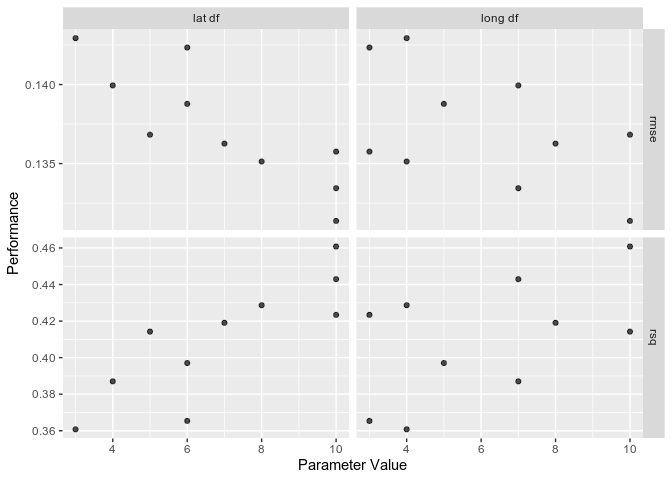

<!-- README.md is generated from README.Rmd. Please edit that file -->

# shinytune

<!-- badges: start -->

<!-- badges: end -->

The goal of shinytune is to make it easy to explore `tune` objects,
similar to `shinystan`.

To do this I need to:

  - \[ \] Figure out exactly what `tune` is producing
  - \[ \] Think about some sensible
    summaries/visualisations/explorations that could be applied to that
  - \[ \] (Optionally) Compare to `shinystan` for reference (I don’t
    want to anchor too strongly to it, though)

## Exploring `tune`

Firstly, I need to figure out what `tune` object actually contains.

Let’s create one following the Getting Started guide on the [tune
website](https://tidymodels.github.io/tune/articles/getting_started.html).

``` r
library(tidymodels)
#> ── Attaching packages ─────────────────────────────────────────────────────────────────────────────────────────────────────────────────────────────────── tidymodels 0.0.3 ──
#> ✓ broom     0.5.2     ✓ purrr     0.3.3
#> ✓ dials     0.0.4     ✓ recipes   0.1.9
#> ✓ dplyr     0.8.4     ✓ rsample   0.0.5
#> ✓ ggplot2   3.2.1     ✓ tibble    2.1.3
#> ✓ infer     0.5.1     ✓ yardstick 0.0.5
#> ✓ parsnip   0.0.5
#> ── Conflicts ────────────────────────────────────────────────────────────────────────────────────────────────────────────────────────────────────── tidymodels_conflicts() ──
#> x purrr::discard()    masks scales::discard()
#> x dplyr::filter()     masks stats::filter()
#> x dplyr::lag()        masks stats::lag()
#> x ggplot2::margin()   masks dials::margin()
#> x recipes::step()     masks stats::step()
#> x recipes::yj_trans() masks scales::yj_trans()
library(tune)
```

### Create the tune objects

Let’s just create the whole set of outputs for the Getting Started
vignette.

Firstly we’ll set up the data:

``` r
library(AmesHousing)

ames <- make_ames()

set.seed(4595)
data_split <- initial_split(ames, strata = "Sale_Price")
ames_train <- training(data_split)
ames_test  <- testing(data_split)
```

Then the baseline
recipe

``` r
ames_rec <- recipe(Sale_Price ~ Longitude + Latitude, data = ames_train) %>% 
  step_log(Sale_Price, base = 10) %>% 
  step_ns(Longitude, deg_free = tune("long df")) %>% 
  step_ns(Latitude,  deg_free = tune("lat df"))

ames_rec
#> Data Recipe
#> 
#> Inputs:
#> 
#>       role #variables
#>    outcome          1
#>  predictor          2
#> 
#> Operations:
#> 
#> Log transformation on Sale_Price
#> Natural Splines on Longitude
#> Natural Splines on Latitude
```

Then update the parameters to use a better function with a wider range:

``` r
ames_param <- ames_rec %>% 
  parameters() %>% 
  update(
    `long df` = spline_degree(), 
    `lat df` = spline_degree()
  )

ames_param
#> Collection of 2 parameters for tuning
#> 
#>       id parameter type object class
#>  long df       deg_free    nparam[+]
#>   lat df       deg_free    nparam[+]
```

Then we’ll set up the (grid) search space of values for these
parameters:

``` r
spline_grid <- grid_max_entropy(ames_param, size = 10)
spline_grid
#> # A tibble: 10 x 2
#>    `long df` `lat df`
#>        <int>    <int>
#>  1         3        6
#>  2        10       10
#>  3         8        7
#>  4         3       10
#>  5         7       10
#>  6         4        3
#>  7         4        8
#>  8         7        4
#>  9         5        6
#> 10        10        5
```

Then our (linear) model:

``` r
lm_mod <- linear_reg() %>% 
    set_engine("lm")

lm_mod
#> Linear Regression Model Specification (regression)
#> 
#> Computational engine: lm
```

Then we’ll set up the cross validation scheme to search over:

``` r
set.seed(2453)
cv_splits <- vfold_cv(ames_train, v = 10, strata = "Sale_Price")
```

#### `tune_grid()`

Then finally we’ll do the tuning using `tune_grid()`:

``` r
ames_res <- tune_grid(
    ames_rec,
    model = lm_mod,
    resamples = cv_splits,
    grid = spline_grid
)
ames_res
#> #  10-fold cross-validation using stratification 
#> # A tibble: 10 x 4
#>    splits           id     .metrics          .notes          
#>  * <list>           <chr>  <list>            <list>          
#>  1 <split [2K/221]> Fold01 <tibble [20 × 5]> <tibble [0 × 1]>
#>  2 <split [2K/220]> Fold02 <tibble [20 × 5]> <tibble [0 × 1]>
#>  3 <split [2K/220]> Fold03 <tibble [20 × 5]> <tibble [0 × 1]>
#>  4 <split [2K/220]> Fold04 <tibble [20 × 5]> <tibble [0 × 1]>
#>  5 <split [2K/220]> Fold05 <tibble [20 × 5]> <tibble [0 × 1]>
#>  6 <split [2K/220]> Fold06 <tibble [20 × 5]> <tibble [0 × 1]>
#>  7 <split [2K/220]> Fold07 <tibble [20 × 5]> <tibble [0 × 1]>
#>  8 <split [2K/220]> Fold08 <tibble [20 × 5]> <tibble [0 × 1]>
#>  9 <split [2K/220]> Fold09 <tibble [20 × 5]> <tibble [0 × 1]>
#> 10 <split [2K/218]> Fold10 <tibble [20 × 5]> <tibble [0 × 1]>
```

Let’s start out by looking at the class of those results:

``` r
class(ames_res)
#> [1] "tune_results" "vfold_cv"     "rset"         "tbl_df"      
#> [5] "tbl"          "data.frame"
```

As detailed in the `?tune_grid` documentation, we have an updated
resamples result, but with some new info an an extra class. But
ultimately it’s still a rectangle. Let’s check the methods for the new
class (the first one) to see what might be available “for free”.

``` r
methods(class = class(ames_res)[[1]])
#> [1] autoplot
#> see '?methods' for accessing help and source code
```

So the only built-in method for the `_results` is `autoplot()`. So
there’s not a huge amount we get out using S3.

What does the `autoplot()` look like?

``` r
autoplot(ames_res)
```

<!-- -->

We’ve got the performance metrics over our parameter value(s).

Let’s look at the extra columns in a bit more detail:

``` r
ames_res$.metrics[[1]]
#> # A tibble: 20 x 5
#>    `long df` `lat df` .metric .estimator .estimate
#>        <int>    <int> <chr>   <chr>          <dbl>
#>  1         3        6 rmse    standard       0.146
#>  2         3        6 rsq     standard       0.393
#>  3        10       10 rmse    standard       0.136
#>  4        10       10 rsq     standard       0.473
#>  5         8        7 rmse    standard       0.142
#>  6         8        7 rsq     standard       0.428
#>  7         3       10 rmse    standard       0.137
#>  8         3       10 rsq     standard       0.468
#>  9         7       10 rmse    standard       0.136
#> 10         7       10 rsq     standard       0.474
#> 11         4        3 rmse    standard       0.150
#> 12         4        3 rsq     standard       0.361
#> 13         4        8 rmse    standard       0.138
#> 14         4        8 rsq     standard       0.455
#> 15         7        4 rmse    standard       0.145
#> 16         7        4 rsq     standard       0.403
#> 17         5        6 rmse    standard       0.144
#> 18         5        6 rsq     standard       0.415
#> 19        10        5 rmse    standard       0.143
#> 20        10        5 rsq     standard       0.416
```

`.metrics`, contrains the error/summary metrics for each combination of
the parameters in our grid. Per the docs, the model type informs the
default choice of metric, but we can also specify what we’re after with
the `metrics` parameter in `tune_grid()`.

The `.notes` column should contain extra warnings/errors that occurred
during execution.

``` r
map_dfr(ames_res$.notes, I)
#> # A tibble: 0 x 1
#> # … with 1 variable: .notes <chr>
```

We didn’t have any here.

The docs also show the `collect_metrics()` function for aggregating the
error metrics over the resamples. We can get summary (mean) values per
grid combination (the default):

``` r
collect_metrics(ames_res)
#> # A tibble: 20 x 7
#>    `long df` `lat df` .metric .estimator  mean     n std_err
#>        <int>    <int> <chr>   <chr>      <dbl> <int>   <dbl>
#>  1         3        6 rmse    standard   0.142    10 0.00216
#>  2         3        6 rsq     standard   0.365    10 0.0169 
#>  3         3       10 rmse    standard   0.136    10 0.00234
#>  4         3       10 rsq     standard   0.423    10 0.0164 
#>  5         4        3 rmse    standard   0.143    10 0.00231
#>  6         4        3 rsq     standard   0.361    10 0.0160 
#>  7         4        8 rmse    standard   0.135    10 0.00227
#>  8         4        8 rsq     standard   0.429    10 0.0151 
#>  9         5        6 rmse    standard   0.139    10 0.00216
#> 10         5        6 rsq     standard   0.397    10 0.0142 
#> 11         7        4 rmse    standard   0.140    10 0.00221
#> 12         7        4 rsq     standard   0.387    10 0.0140 
#> 13         7       10 rmse    standard   0.133    10 0.00236
#> 14         7       10 rsq     standard   0.443    10 0.0146 
#> 15         8        7 rmse    standard   0.136    10 0.00233
#> 16         8        7 rsq     standard   0.419    10 0.0153 
#> 17        10        5 rmse    standard   0.137    10 0.00228
#> 18        10        5 rsq     standard   0.414    10 0.0140 
#> 19        10       10 rmse    standard   0.131    10 0.00243
#> 20        10       10 rsq     standard   0.461    10 0.0146
```

Or not, in which case we get the exact metrics from each fold (maybe
useful if we want to compute our own summaries).

``` r
collect_metrics(ames_res, FALSE)
#> # A tibble: 200 x 6
#>    id     `long df` `lat df` .metric .estimator .estimate
#>    <chr>      <int>    <int> <chr>   <chr>          <dbl>
#>  1 Fold01         3        6 rmse    standard       0.146
#>  2 Fold01         3        6 rsq     standard       0.393
#>  3 Fold01        10       10 rmse    standard       0.136
#>  4 Fold01        10       10 rsq     standard       0.473
#>  5 Fold01         8        7 rmse    standard       0.142
#>  6 Fold01         8        7 rsq     standard       0.428
#>  7 Fold01         3       10 rmse    standard       0.137
#>  8 Fold01         3       10 rsq     standard       0.468
#>  9 Fold01         7       10 rmse    standard       0.136
#> 10 Fold01         7       10 rsq     standard       0.474
#> # … with 190 more rows
```

The documentation then uses these result to plot/calcualte bespoke
summaries to inform modelling decisions, and the use of `tune` or other
`tidymodels` functions/packages seems to end.

In any case, the output seems reasonably simple: `tune_grid()` will
return a set of metrics (that may be customised via the `metrics`)
argument for each combination in the grid.
